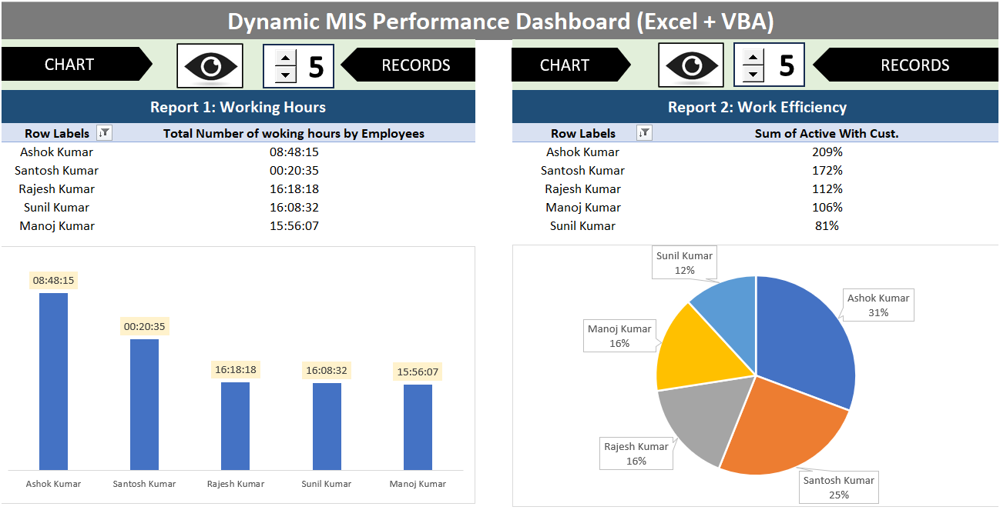
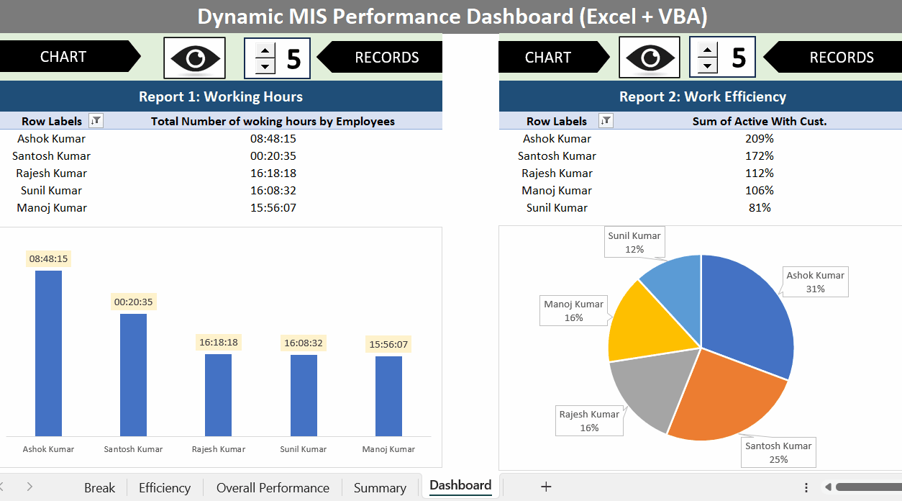

# 📊 Dynamic MIS Performance Dashboard (Excel + VBA)

## 📌 Project Overview

This project is an interactive **MIS (Management Information System) Dashboard** built using Microsoft Excel with **Macros and VBA automation**.

It helps track:

* Employee working hours
* Work efficiency
* Performance insights
* Productivity metrics

---

## 🚀 Key Features

* Interactive dashboard with filters/slicers
* Automated calculations using VBA
* Real-time data updates
* Multi-sheet structured workflow
* Clean and user-friendly UI

---

## 🛠 Tools & Technologies

* Microsoft Excel
* VBA (Visual Basic for Applications)
* Pivot Tables & Charts

---

## 📸 Dashboard Preview

---

## 🎥 Interactive Demo

---

## 📁 Project Structure

* **Basic** → Raw data
* **Break** → Break tracking
* **Efficiency** → Performance calculations
* **Overall Performance** → Aggregated metrics
* **Summary** → Insights
* **Dashboard** → Visualization

---

## ⚙️ How to Use

1. Download the `.xlsm` file
2. Open in Excel
3. Enable Macros
4. Go to Dashboard sheet
5. Use filters to interact

---

## ⭐ Key Highlights

* End-to-end MIS dashboard solution
* VBA automation reduces manual work
* Strong use of Excel analytics tools
* Interactive and dynamic reporting

---

## 👩‍💻 Author

**Nidhi Gupta**
